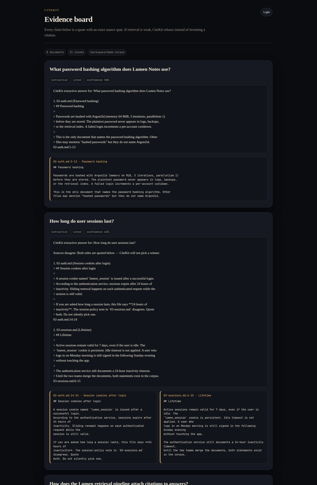
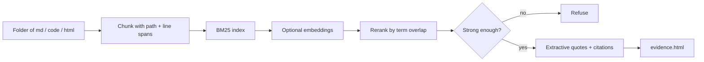

# CiteKit

**Citation-first RAG for coding agents.**

Ingest a folder. Ask a question. The answer may only use retrieved quotes, and every claim carries a span like `docs/auth.md:42-58`. If retrieval is weak, CiteKit **refuses** instead of hallucinating a source.

[](LICENSE)
[](package.json)
[](tsconfig.json)

- **Zero API keys** for the default extractive path. `npx citekit demo` works offline.
- **Agent-native**: MCP stdio tools + a Cursor/Claude `SKILL.md`.
- **Evidence board**: one self-contained HTML file — quotes, citations, files↔claims graph, dark/light.



<p align="center"><sub>Generated by <code>npx citekit demo</code> → <code>demo-out/evidence.html</code>. Quotes, spans, and a files↔claims graph — one HTML file, no CDN.</sub></p>

## Quick start

```bash
npx citekit demo
npx citekit doctor
npx citekit ingest ./docs
npx citekit ask "How does auth work?"
npx citekit board
npx citekit mcp
```

`citekit demo` ingests the bundled Lumen Notes corpus, asks three questions, writes `demo-out/evidence.html`, and prints cited answers. No account. No key. No Docker.

## Example output

```
What password hashing algorithm does Lumen Notes use?

CiteKit extractive answer for: What password hashing algorithm does Lumen Notes use?

1. 02-auth.md (Password hashing)
> Passwords are hashed with Argon2id (memory 64 MiB, 3 iterations, parallelism 1)
> before they are stored.
02-auth.md:7-14
```

A conflict question prints **both** sides:

```
How long do user sessions last?

Sources disagree. Both sides are quoted below — CiteKit will not pick a winner.

1. 02-auth.md:16-22     sessions expire after 24 hours of inactivity
2. 03-sessions.md:8-14  sessions remain valid for 7 days, even if idle
```

## How it works



1. **Ingest** walks a directory, skips `node_modules` / `.git` / `dist`, and chunks Markdown on headings and code on function/class-ish blocks. Every chunk stores `path`, `startLine`, `endLine`, `text`, and a hash.
2. **Retrieve** always runs BM25 (MiniSearch, no native addons). If `OPENAI_API_KEY` or `OPENAI_BASE_URL` is set, ingest can add embeddings and ask can fuse scores.
3. **Ask** defaults to extractive mode: stitch the top quotes. Generate mode is optional and is prompted with *only* those quotes plus a hard citation rule.
4. **Board** writes a single HTML file with inline CSS/JS. No CDN.

## Why this, not another RAG

| | CiteKit | Naive vector RAG | Dify / RAGFlow | GitNexus |
| --- | --- | --- | --- | --- |
| Local CLI, one command demo | Yes | Rarely | No | No |
| Exact `path:line-line` citations | Required | Optional / fuzzy | Chunk ids | Code-graph UI |
| Works with zero API keys | Yes | Usually no | No | N/A |
| Refuses when evidence is weak | Yes | No | No | N/A |
| Agent Skill + MCP stdio | Yes | Bring your own | Platform plugins | No |
| Hosted control plane | No | No | Yes | Browser app |

CiteKit is not conversation memory, not a diagram tool, and not a LangChain wrapper. It is a small citation engine you can run next to an agent.

## CLI

| Command | What it does |
| --- | --- |
| `citekit demo` | Ingest bundled corpus, ask 3 questions, write `demo-out/evidence.html` |
| `citekit doctor` | Node version, write permissions, optional OpenAI settings |
| `citekit ingest <dir>` | Build `.citekit/index.json` |
| `citekit ask "…"` | Cited answer (`--mode generate` if a key is set) |
| `citekit search "…"` | Ranked spans |
| `citekit board` | Write `evidence.html` from the last ask |
| `citekit mcp` | stdio MCP server |
| `citekit skill` | Print / `--install` the Agent Skill |

Index files live in `.citekit/` (JSON + serialized MiniSearch). `npm test` never compiles native SQLite.

## MCP

Tools: `citekit_ingest`, `citekit_search`, `citekit_ask`. Citations come back as structured `path` / `startLine` / `endLine` / `quote` data.

```json
{
  "mcpServers": {
    "citekit": {
      "command": "npx",
      "args": ["citekit", "mcp"]
    }
  }
}
```

## Cursor / Claude skill

```bash
npx citekit skill --install
# or
mkdir -p .cursor/skills/citekit
cp skills/citekit/SKILL.md .cursor/skills/citekit/SKILL.md
```

The skill tells the agent: ingest the repo, call `citekit_search` / `citekit_ask`, and never answer a repo question without a span.

## Optional LLM path

Extractive mode is the product. If you set `OPENAI_API_KEY` or `OPENAI_BASE_URL`, CiteKit can:

- embed chunks at ingest and fuse BM25 + cosine at ask
- run `--mode generate`, which still sees **only** retrieved quotes

Use any OpenAI-compatible `/v1/chat/completions` and `/v1/embeddings`. There is no LangChain dependency.

```bash
export OPENAI_API_KEY=sk-...
citekit ingest ./docs
citekit ask --mode generate "How does auth work?"
```

## Library

```ts
import { ingest, ask, loadStore } from "citekit";

await ingest({ root: "./docs", outDir: ".citekit" });
const store = await loadStore(".citekit");
const result = await ask(store, "How does billing cap private notes?");
```

## Development

```bash
git clone https://github.com/SabreKeyZ/citekit.git
cd citekit
npm install
npm test
npm run build
npm run demo
```

Node 20+. MIT. See [CONTRIBUTING.md](CONTRIBUTING.md).

---

## 中文

**CiteKit** 是给编程 Agent 用的「先引用、后回答」检索工具。你摄入一个目录（Markdown、文本、代码、HTML），CiteKit 按标题或函数块切分，并保留精确的 `路径:起始行-结束行`。提问之后，答案只能使用检索到的原文；每条论断都带引用。检索不够强时直接 **拒绝回答**，而不是编造来源。

- 一条命令演示，**不需要任何 API Key**：`npx citekit demo`
- 面向 Agent：MCP stdio（`citekit_ingest` / `citekit_search` / `citekit_ask`）+ `skills/citekit/SKILL.md`
- 单文件证据板：`citekit board` 写出带暗色/亮色主题的 `evidence.html`，展示引用卡片和文件↔论断图

```bash
npx citekit ingest ./docs
npx citekit ask "认证是怎么做的？"
npx citekit board
```

和「把整库打进向量库再让模型自由发挥」不同：CiteKit 默认是抽取式的，引用是硬约束。它也不是 Dify/RAGFlow 那样的重型平台，不是代码图谱浏览器，不是对话记忆插件。

冲突语料会被同时引用。演示语料里，认证文档写「空闲 24 小时掉线」，会话政策写「7 天有效」——CiteKit 会把两边都摆出来，而不是擅自选一个。
